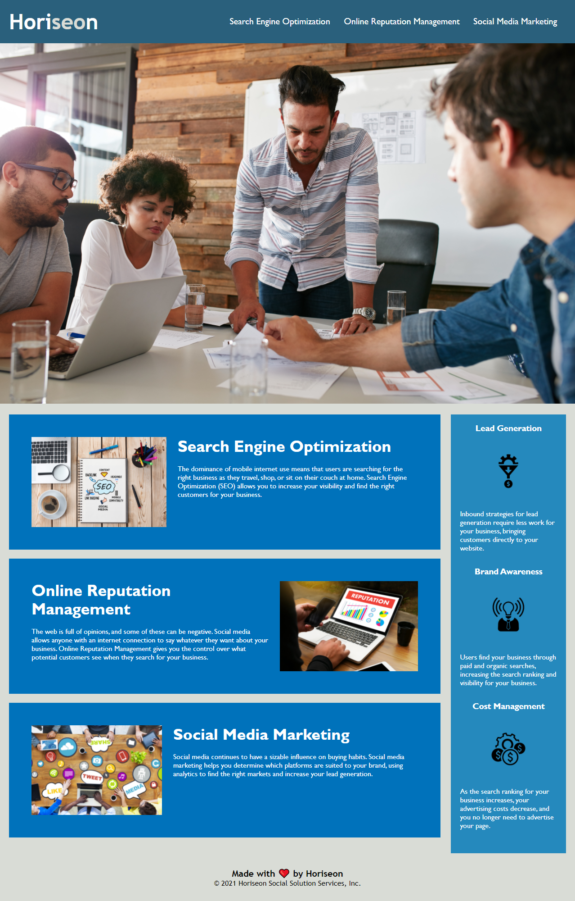

# Horiseon Code Refactor

## Purpose

 Assist the reputation management company, Horiseon, in improving
 
 search engine optimization and adherence to accessibility standards.

## Description
In this project, actions were taken to meet accessibility standards, including:
* Restructured code to follow semantic elements
* Reordered code to follow a logical structure
* Added alt attributes to image elements
* Fixed broken links
* Give the page a concise, descriptive title

## Built With
* HTML
* CSS

## Website
You can view the live deployment [HERE](https://esimondet.github.io/challenge-one-code-refactor/)

## Screenshot of landing page

## Contribution
Completed by Edison Simondet

Visit my Github [HERE](https://github.com/esimondet/challenge-one-code-refactor)
